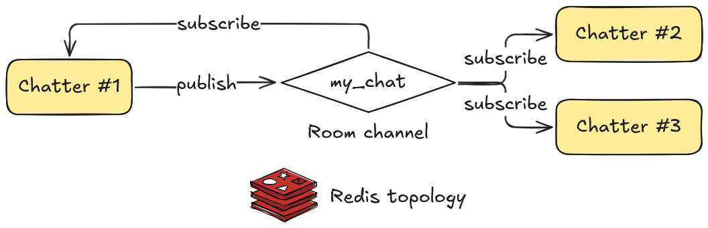
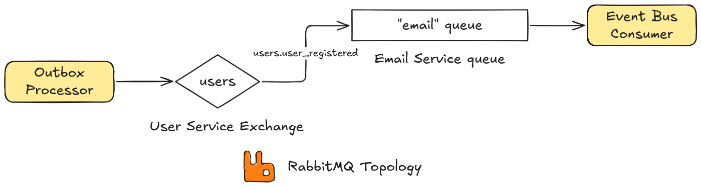

# events

**events** is a small package for domain and integration events.

## Domain events

To be written...

### Dishka event handler factory

To be written...

## Integration events

To be written...

## Examples

Check out the [examples](./examples) folder!

- [online_chat](./examples/online_chat) implements an online chat using FastAPI and Redis pub/sub as an integration event bus to send messages between chatters

    

- [user_registration](./examples/user_registration) mimics user email verification system after registration. This example demonstrates the use of domain events and domain event handlers in an Outbox pattern and implements communication between `user` and `email` service using RabbitMQ integration event bus.

    

