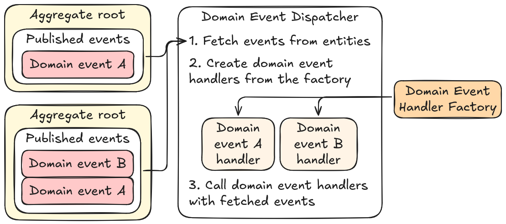

# events

**events** is a my small package for domain and integration events.

- [Installation](#installation)
- [Domain events](#domain-events)
  - [Toy example: order and invoice](#toy-example-order-and-invoice)
  - [Dishka event handler factory](#dishka-event-handler-factory)
- [Integration events](#integration-events)
  - [Sending and receiving events](#sending-and-receiving-events)
  - [Constructing integration events](#constructing-integration-events)
- [Examples](#examples)

## Installation

This package can be installed from this repo with your package manager of choice.

```bash
pip install git+https://github.com/ACherryJam/events.git
pipx install git+https://github.com/ACherryJam/events.git
poetry add git+https://github.com/ACherryJam/events.git
uv add git+https://github.com/ACherryJam/events.git
```

## Domain events

**Domain event** is a message about something of interest that already happening in the domain. Domain events are published by the aggregates and provide a way to execute logic without these aggregates knowing about it, promoting low coupling. Domain events are handled in the same transactional scope.

- `DomainEvent` is the message to be published
- `AggregateRoot` is the entity publishing the event
- `DomainEventHandler` reacts to the published event
- `DomainEventHandlerFactory` creates event handlers
- `DomainEventDispatcher` processes published events by creating the right handlers from the factory and calling them

<div align="center">
    
</div>

### Toy example: order and invoice

As a toy example, suppose an online shop needs to create an invoice when the order is completed.

1. Create a domain event to be handled

```python
@dataclass
class OrderCompleted(DomainEvent):
    # Domain event has a mandatory `type` abstract property to be defined
    type: str = "order.completed"
    order: Order
```

2. Publish the event in the aggregate root

```python
class Order(AggregateRoot):
    ...

    def complete(self) -> None:
        if len(self.items) == 0:
            raise Exception("Can't complete an empty order")

        self.status = OrderStatus.COMPLETED
        self.publish_event(OrderCompleted(self))
```

3. Create a domain event handler. To let `events` know that `CreateInvoiceOnOrderCompleted` handles `OrderCompleted`, event type is added to the template of `DomainEventHandler` base class.

```python
class CreateInvoiceOnOrderCompleted(DomainEventHandler[OrderCompleted]):
    def __init__(self, repository: InvoiceRepository):
        self.repository = repository

    async def handle(self, event: OrderCompleted) -> None:
        invoice = Invoice(
            id=self.repository.get_next_id(),
            order_id=event.order.id
        )
        await self.repository.insert(invoice)
```

4. In the use case, get events from the aggregate and call handlers from domain event dispatcher

```python
class CompleteOrderInteractor:
    def __init__(
        self,
        dispatcher: DomainEventDispatcher,
        repository: OrderRepository,
        transaction: Transaction
    ):
        self.dispathcer = dispatcher
        self.repository = repository
        self.transaction = transaction

    async def __call__(self, order_id: OrderId) -> None:
        try:
            # 1. Get order and mark it as completed
            order = await self.repository.get_by_id(order_id)
            order.complete()

            # 2. Get events from the order entity
            self.dispatcher.from_entity(order)

            # 3. Call process() to call handlers
            # This will call CreateInvoiceOnOrderCompleted and add the invoice in the same transaction
            # If that fails, nothing gets saved
            await self.dispatcher.process()

            # 4. Update the order and commit the transaction to save it
            await self.repository.update(order)
            await self.transaction.commit()
        except:
            await self.transaction.rollback()
            raise
```

Dispatcher can also be called as a async context manager.

```python
# Events are processed at context manager exit
async with self.dispatcher:
    order = await self.repository.get_by_id(order_id)
    order.complete()

    self.dispatcher.from_entity(order)
```

### Dishka event handler factory

`events` provides one event handler factory implementation, that uses [dishka](https://dishka.readthedocs.io/en/stable/) to create domain event handlers. To use it, add `DomainEventImplementationProvider` to your container. Domain event handlers and the factory are REQUEST-scoped.

By default, `events` adds created domain event handler classes into an registry based on handled event type. You can provide your own handler registry from context.

```python
from dishka import make_async_container
from events.domain.event_handler import DomainEventHandlerRegistry
from events.domain.implementation.dishka import DomainEventImplementationProvider

async def main():
    container = make_async_container(
        DomainEventImplementationProvider(),
        from_context: {
            DomainEventHandlerRegistry: DomainEventHandlerRegistry({
                Event1: [EventHandler1, EventHandler2],
                Event2: [EventHandler3]
            })
        }
    )
```

## Integration events

**Integration events** are messages about something of interest for other bounded contexts. As opposed to domain events, that are handled in the same transactional scope, integration events are asynchronous messages sent to other services (or possibly other instances of sender service). Integration events should contain only the information that is necessary for other services to do their work.

### Sending and receiving events

**Integration event bus** is an abstraction for sending and receiving integration events. _Producers_ send integration events to a _topic_. _Consumers_ register themself to receive specified events from a specified _topic_.

Before using the bus, it needs to be started up with `startup()` method. `shutdown()` method is called the app is done using the integration event bus.

To send an event, `IntegrationEventBus.send` method is used. It receives a topic to be sent to and integration event instance.

```python
from events.integration.topology import Topic, Consumer, IntegrationEventBusRegistration

async def main():
    bus = IntegrationEventBusImpl()
    await bus.startup()

    await bus.send(
        topic=Topic("topic_name"),
        IntegrationEvent1()
    )

    await bus.shutdown()
```

To register a consumer, `IntegrationEventBusRegistration` class is used. It receives a named consumer, named topic and event types to receive. With these registrations, integration event bus will construct a topology, depending on its implementation and inderlying techology used. See [examples](#examples) for RabbitMQ and Redis pub/sub bus implementations.

```python
from events.integration.topology import Topic, Consumer, IntegrationEventBusRegistration

async def main():
    bus = IntegrationEventBusImpl()

    await bus.register(
        IntegrationEventBusRegistration(
            consumer=Consumer(
                name="consumer_name"
            ),
            topic=Topic(
                name="topic_name"
            ),
            events=[EventType1, EventType2]
        )
    )
    await bus.startup()

    # app main loop

    await bus.shutdown()
```

`Consumer` is an [abstract class](./src/events/integration/topology/consumer/base.py), that has to implement `on_event` method. `events` provides an implementation called `EventHandlerConsumer`. It receives a dictionary of event types and lists of functions that accept the event.

```python
from events.integration.topology import Topic, IntegrationEventBusRegistration
from events.integration.topology.consumer import EventHandlerConsumer

async def print_event(event: UserRegisteredV1):
    print(event.email, "registered!")

consumer = EventHandlerConsumer(
    name="email",
    handlers={
        UserRegisteredV1: [print_event,]
    }
)

await bus.register(
    IntegrationEventBusRegistation(
        consumer=consumer,
        topic=Topic("users"),
        events=consumer.handlers.keys()
    )
)
```

### Constructing integration events

To define an integration event, subclass `IntegrationEvent` and provide default `type` and `version` fields and wrap it with `dataclass` decorator.

<details>
    <summary>Why not use Pydantic?</summary>

---

I wanted to be able to get the event type from both class and class instance and I didn't like how class vars are not accessible from the instances and normal vars are not accessible from classes. Honestly, that's kind of it :p

It's just easier to implement this way. Also, probably faster!

```python
class IntegrationEvent(BaseModel):
    type: ClassVar[str]
    version: ClassVar[int]

class UserRegisteredV1(IntegrationEvent):
    type = "users.registered"
    version = 1

    email: str

event = UserRegisteredV1(email="a@localhost")
print(UserRegisteredV1.type)  # Works
print(event.type)             # Will throw
print(event.model_fields["type"].default)  # Very unergonomic?
```

```python
class IntegrationEvent(BaseModel):
    type: str
    version: int

class UserRegistered(IntegrationEvent):
    type = "users.registered"
    version = 1

    email: str

event = UserRegistered(email="a@localhost")
print(event.type)           # Works
print(UserRegisteredV1.type)  # Won't work :(
print(UserRegisteredV1.model_fields["type"].default)  # Same issue
```

---

</details>

```python
@dataclass
class UserRegisteredV1(IntegrationEvent):
    type: str = "user.registered"
    version: int = 1

    email: str
```

Integration events can be converted to dict and constructed from dict with `to_dict` and `from_dict` methods respectfully. When constructing from dict, `type` value is used as a discriminator to construct the right class instance.

```python
event = UserRegisteredV1(email="bbb@gmail.com")

payload = event.to_dict()
print(payload)
# { "type": "user.registered", "version": 1, "email": "bbb@gmail.com" }

constructed_event = IntegrationEvent.from_dict(payload)
print(constructed_event)
# UserRegisteredV1(type="user.registered", version=1, email="bbb@gmail.com")
```

## Examples

Check out the [examples](./examples)!

- [online_chat](./examples/online_chat) implements an online chat using FastAPI and Redis pub/sub as an integration event bus to send messages between chatters

<div align="center">
    
</div>

- [user_registration](./examples/user_registration) mimics user email verification system after registration. This example demonstrates the use of domain events and domain event handlers in an Outbox pattern and implements communication between `user` and `email` service using RabbitMQ integration event bus.

<div align="center">
    
</div>
