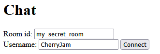
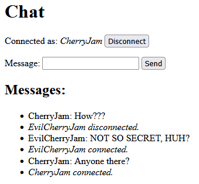

# Online chat

An example of pubsub-type integration bus implementation using Redis.

- [How to run](#how-to-run)
- [Redis integration event bus](#redis-integration-event-bus)
- [How to use](#how-to-use)

## How to run

1. Create virtual environment and install dependencies

```bash
uv venv
.venv/Scripts/activate or source .venv/bin/activate
uv sync
```

2. Start Redis

```bash
redis-server # (at least that's how it is on Windows)
```

3. Run uvicorn server

```bash
uvicorn app:app
```

## Redis integration event bus

This app uses Redis pub/sub as an [ephemeral integration event bus](/src/app/bus.py). Topics are named after room ids. The topic names are used as channels to publish and subscribe to. Consumer names in the context of Redis pub/sub does not matter and can be anything. This event bus sends the message from a producer to all consumers.

<div align="center">
    
</div>

## How to use

1. Enter the chat website at http://127.0.0.1:8000/
2. Enter room id and username, click "Connect"

<div align="center">
    
</div>

3. Send messages!

<div align="center">
    
</div>
